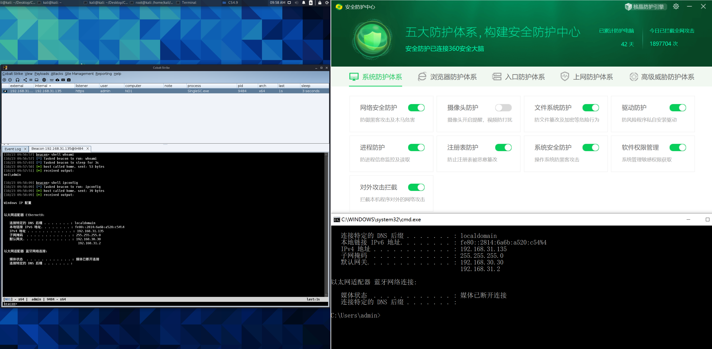
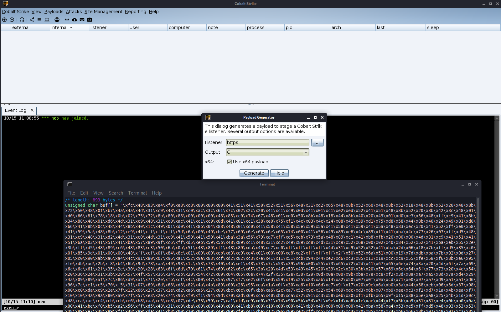
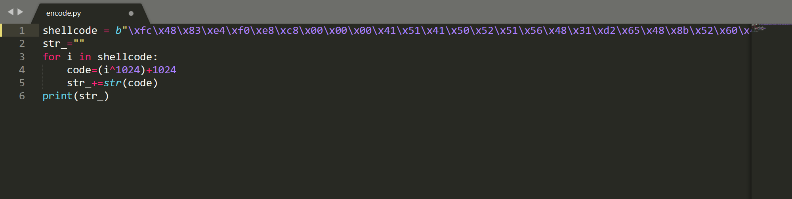
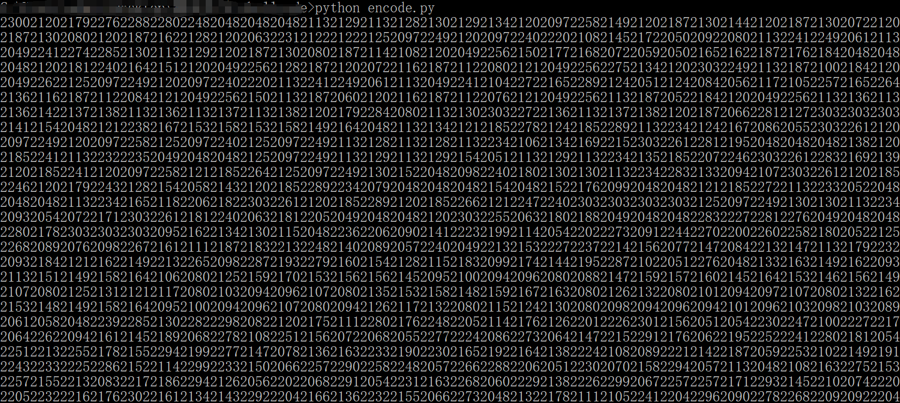
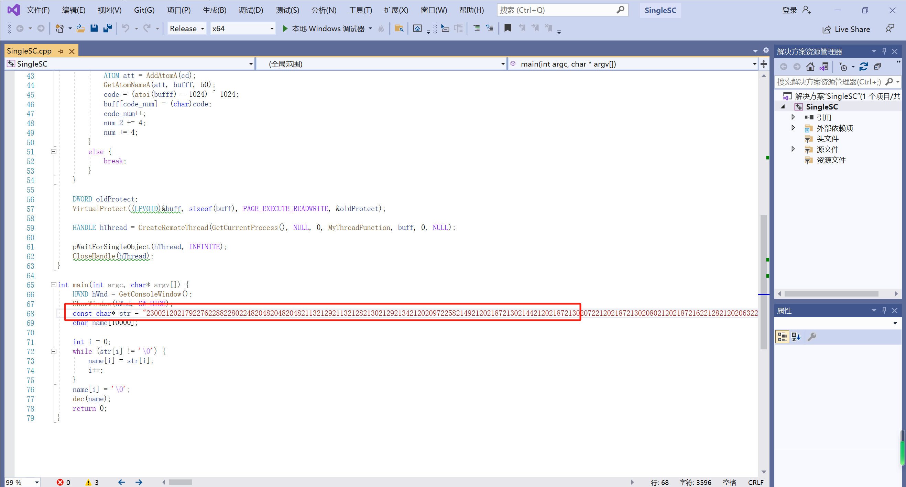

# 鱼饵-SingleSC 10.25 红队免杀加载器分享

## 目录

-   [免杀效果](#免杀效果)
-   [使用方法](#使用方法)

## 免杀效果

于10.23 24日测试 360核晶与火绒均可过！

Bypass360核晶

Bypass火绒

采用与SlientSC相同的shellcode加解密方法进行本地载荷存储，后通过WaitForSingleObject函数绕过拦截执行载荷。&#x20;

## 使用方法

首先在CS4.9中生成.C格式的shellcode

将所有shellcode取出，放入[encode.py](http://encode.py "encode.py")中的shellcode字符串中

随后生成加密后密文，放入C++代码

